== St. Gallen

Asuntomme Sveitsissä sijaitsee https://fi.wikipedia.org/wiki/Sankt_Gallen[St. Gallenin (Sankt Gallen)]  kaupungissa. 
Itse kaupunki sijaitsee Sankt Gallen piirikunnassa (eli "Kanton" paikallisella kielellä), joka on siis yksi Sveitsin 26 piirikunnasta (piirikunnat muodostavat Sveitsin liittovaltion).

St. Gallen on väkiluvultaan melko pieni/keskikokoinen, vakinaisia asukkaita täällä on n. 75 tuhatta. 
Se vastaa väkiluvultaan melko lähelle Suomen 13:nneksi suurimman kaupungin https://fi.wikipedia.org/wiki/Lappeenranta[Lappeenrannan] väkilukua.

++++
<iframe src="https://www.google.com/maps/embed?pb=!1m18!1m12!1m3!1d1601419.9163719267!2d7.104246293360655!3d46.78996487314719!2m3!1f0!2f0!3f0!3m2!1i1024!2i768!4f13.1!3m3!1m2!1s0x479b1e297633d855%3A0x9a2250081ffe6114!2sSt.%20Gallen!5e0!3m2!1sfi!2sch!4v1582978885374!5m2!1sfi!2sch" width="600" height="450" frameborder="0" style="border:0;" allowfullscreen=""></iframe>
++++

Kaupunki ympäristöineen vaikuttaa myös siistiltä.
Arkkitehtuuria täällä pääse myös ihailemaan, koska osa rakennuksista on rakennettu useita satoja vuosia sitten (esim. https://fi.wikipedia.org/wiki/St._Gallenin_luostari[vuonna 720 rakennettu Luostari])

Alla muutamia otoksia kaupungista.

.Puisto
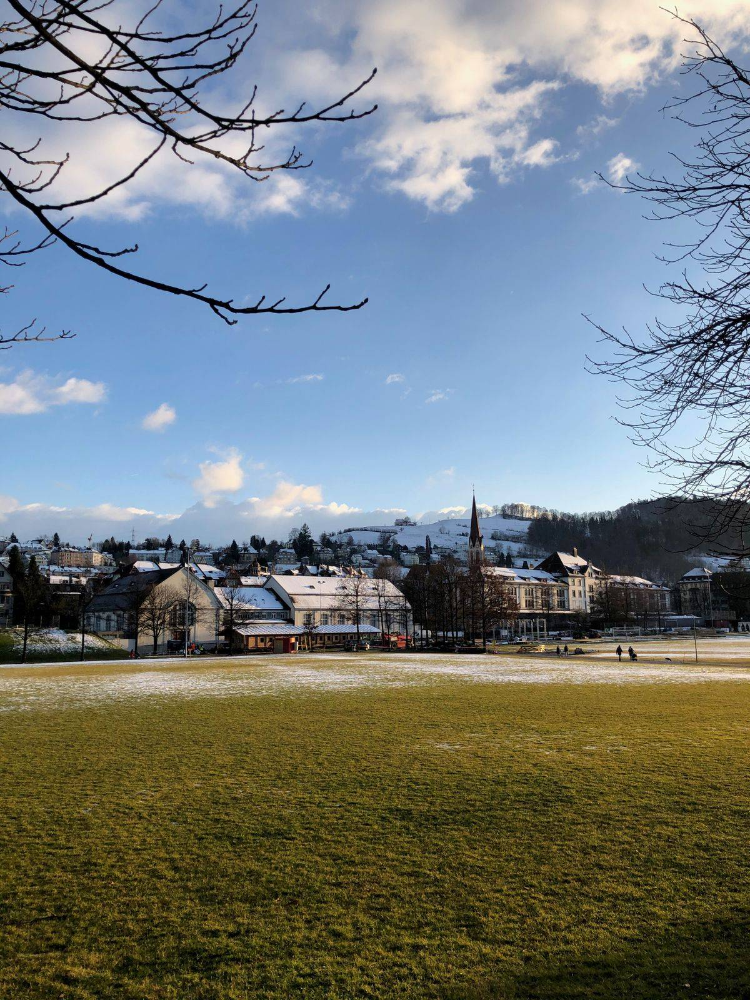

.Läheinen kukkula
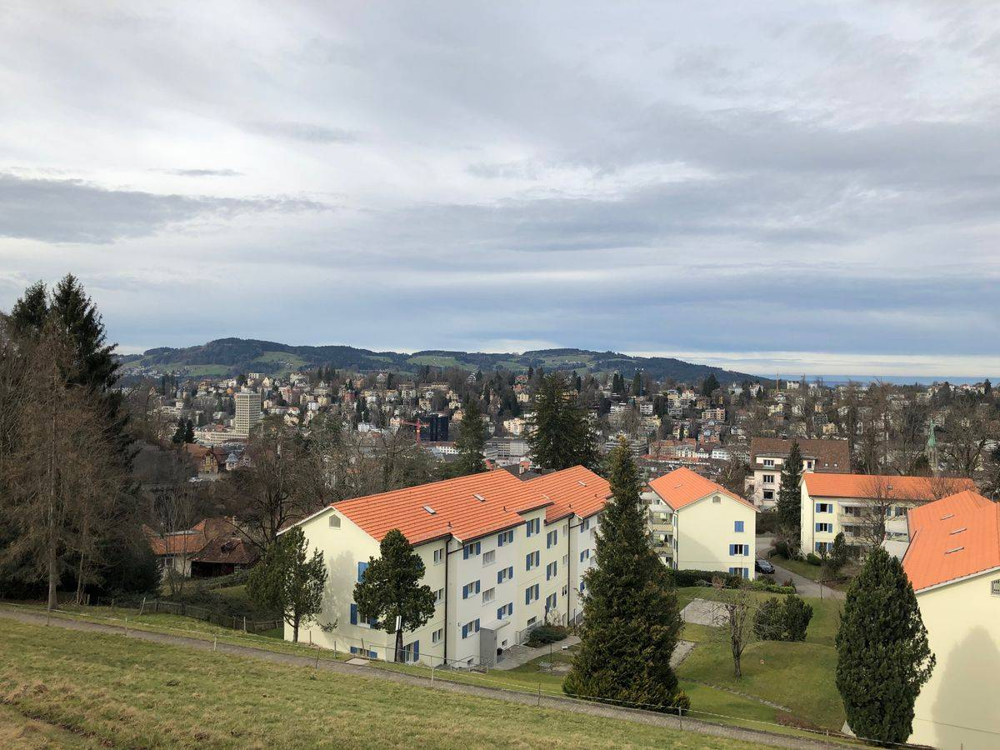

Keskustan tuntumasta lähtee pieni kävelypolku joka vielä ylös läheiselle kukkulalle.
Tätä polkua kävellessä pääse kaupunkia katselemaan hieman korkeammasta perspektiivistä.

.Luostarin aukio
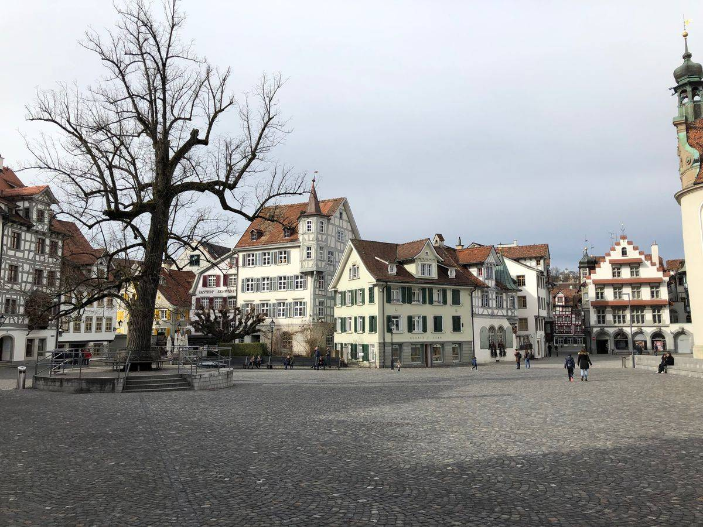

Vanhan luostarin vieressä sijaitseva aukio.

== Talo

Vuokra-asunto sijaitsee vanhassa sveitsiläisessä 3-kerroksisessa talossa.
Talo sijaitsee on n. 15-20 minuutin kävelymatkan päästä päästä keskustasta.
Se on luultavimmin rakennettu joskus 1900-luvun alkupuolella (_ei varmaa tietoa_).

.Kuva talosta vuodelta 1921.
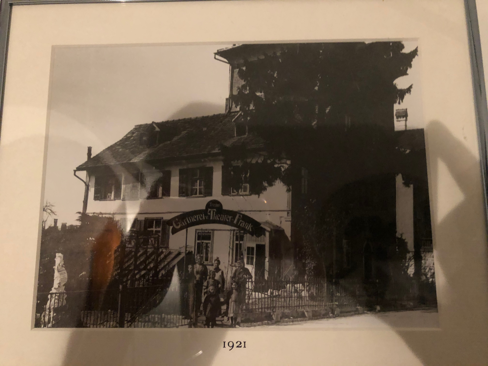

Meidän asuntomme sijaitsee ensimmäisessä kerroksessa (_ei pohjakerroksessa_), jossa sijaitsee myös toinen vaihto-opiskelijoiden asuttama huoneisto.
Ylimmässä kerroksessa asuu talon omistajat, mukava eläkeläispariskunta.

Talon ensimmäiseen kerrokseen noustessa voi myös ihastella (tai kauhistella) seinien koristeeksi laitettuja täytettyjä eläimiä sekä niiden kalloja.

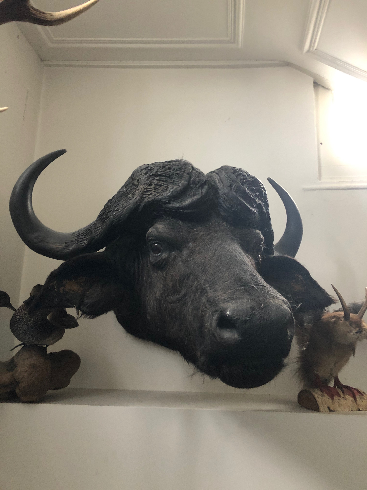

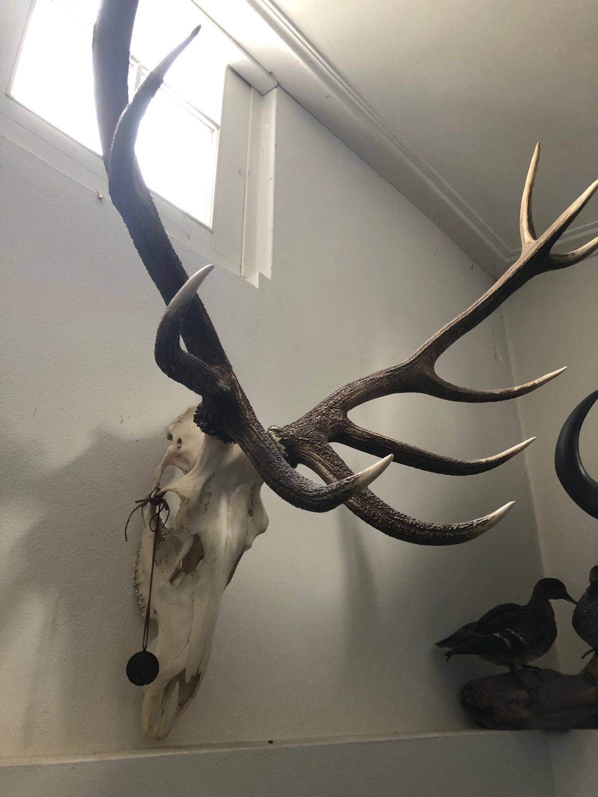

Monet näistä ovat ihan tuttuja lajeja (lintuja, sorkkaeläimiä) mutta niiden seasta löytyy myös yksi laji jota ei ainakaan heti pysty mihinkään tiettyyn eläinlajiin lokeroimaan.

.Was ist das?
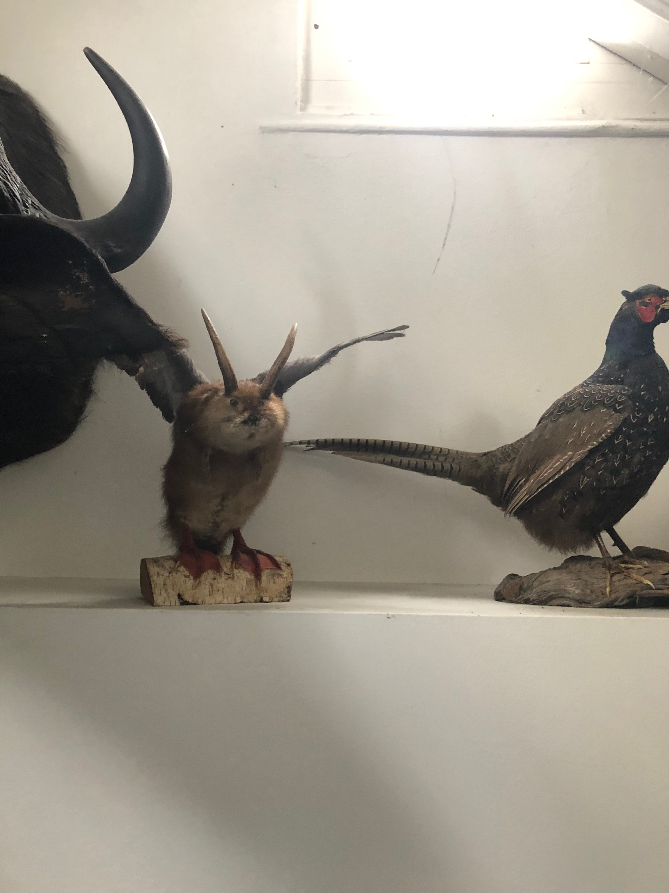

=== Huoneisto

Itse huoneisto on melko tilava. Sieltä löytyy: 

* Kaksi makuuhuonetta
* Olohuone
* Keittiö 
* Wc/suihku.

Alla muutamia panorama-otoksia huoneistosta.

.Eteinen
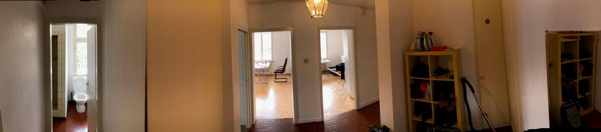

Ensinäkymä kun astutaan sisään huoneistoon. Vasemmalla näkyy Wc/suihku, suoraan edessä käynti keittöön, olohuoneeseen sekä toiseen makuuhuoneeseen.

.Keittiö
image::./keittio.jpeg[caption="", link=./keittio.jpeg]

Kompaktista keittiöstä löytyy jopa astianpesukone, jonka käyttäminen useimmiten on melko turhaa koska astiastoa on niin vähän. _Esim. lautasia on tasan kaksi._

.Olohuone
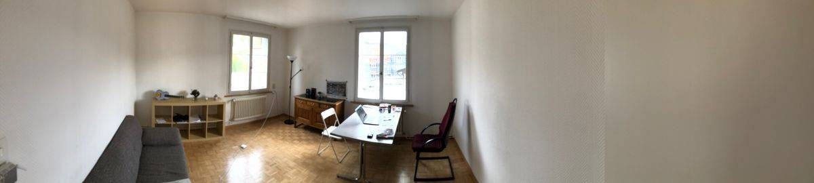

Olohuoneessa ei ole kattolamppua mutta onneksi vuokrantajaa ystävällisesti näytti, kuinka nurkassa olevan jalkalampun saa sammutettua/laitettua päälle valokatkaisijasta.
Tiedä sitten kenen idea tämä oli.

.Makuuhuone (pienempi)
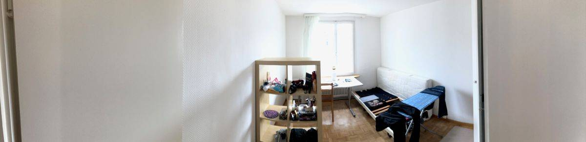

.Makuuhuone (isompi)
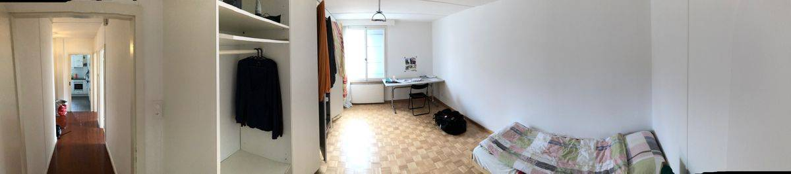

Ylimääräisiä huonekalujahan asunnossa ei pahemmin ole. Nykyinen _decor_ koostuu myös lähinnä vanhoista pöydistä sekä Ikean kasattavista hyllyköistä.
Valittamista tässähän ei sinänsä ole, koska kaikki tarpeellinen kuitenkin löytyy.

Täällä melkein joka talossa ikkunoiden suojana tuollaiset puiset tuulisuojat. 

image::https://cdn.pixabay.com/photo/2016/09/28/04/33/switzerland-1699737_1280.jpg[caption="", link=https://cdn.pixabay.com/photo/2016/09/28/04/33/switzerland-1699737_1280.jpg]

Ensimmäisellä viikolla täällä (ja muualla Euroopassa) oli kuitenkin myrkyisää, varsinkin yöllä.
Osa asunnostamme olevista suojista ei kuitenkaan ollut kunnolla "lukittu" ja tästä syystä ne pääsivät kovien tuulenpuuskien seurauksena liikkumaan.
Ensimmäisenä yönä oli "mukava" herätä keskellä yötä melko kovaan kolahdukseen keittiössä, makuu- ja olohuoneessa.
Ensimmäinen ajatus oli että joku yrittää murtautua tänne, mutta pienen tutkinnan perusteella huomattiin että ääni johtuikin vain noista vapaana heiluvista tuulisuojista.

Makuuhuoneen tuulisuoja saatiin onneksi kiinnitettyä heti mutta keittiön sekä olohuoneen suojia ei onnistuttu saamaan kiinni yöllä.
Tuulisuojista johtuva melu oli näemmä pitänyt hereillä myös yläkerran pariskuntaa. Myöhemmin viikolla, tulee tuo eläkeläismies reippaasti sisälle keskellä päivää ja kävellen huitelee olohuoneen ikkunaa kohden.
Hän kuitenkin näytti miten tuo tuulisuoja saadaan lukittautumaan, joten ne eivät enään ainakaan pidä ääntä 😄.

Meidän lisäksi asunnosta löytyy myös aiempia "vuokralaisia".
Vastaan on tullut sekä lentäviä kuoriaisia sekä hämähäkkejä.
Mieleenpainuvin oli kuitenkin ensikohtaaminen hämähäkin kanssa (hämähäkille se oli myös viimeinen). 

Istuin olohuoneen sohvalla töitä tehden, kunnes huomasin sivusilmällä jonkin liikkuvan. 
Nostin katsetta ja huomasin kuinka hämähäkki vipeltää huoneen toiselta puolelta kohti sohvan vieressä olevaa nurkkaa.
Hieman nousi adrenaliinitasot kun näin että tuollainen n. 5cm kokoinen (halkaisijaltaan) hämähäkki juoksee kohti.
En ole siis luonnossa, vapaana koskaan nähnyt noin isoa hämähäkkiä.
Koska olimme hiljattain muuttaneet, ei meillä asunnossa vielä ollut mitään lehtiä yms millä ois voinut tuota hämähäkkiä lyödä.
Onneksi keittiöstä kuitenkin löytyi uusi https://www.ikea.com/us/en/p/finfoerdela-flexible-chopping-board-dark-gray-dark-turquoise-30335898/[Ikean ohut ja taipuisa leikkausalusta], joka tarpeen tullen toimi oikein hyvin lyömäaseena.
Hämähäkin oikeasta lajista en täysin ole varma mutta uskoisin sen nimensä mukaisesti olevan https://en.wikipedia.org/wiki/Giant_house_spider[Giant house spider (varastohämähäkki)], jota esiintyy sekä Sveitsissä että Suomessa.

Vastaan on myös pariin otteeseen tullut pieniä hämähäkkejä, luultavasti tämän isomman hämähäkin jälkikasvua?
Sveitsissä esiintyvät hämähäkit eivät kuitenkaan ole myrkyllisiä (ainakaan tähän tietoon), joten suurempaa vaaraa niistä ei todennäköisesti ole.
Ne varmaankin auttavat meitä vain hävittämään muita, pienempiä ötököitä.

Itse huoneiston vuokra on 1400 CHF + 50 CHF (Wifi), eli yhteensä 1450 CHF.
Euroihin käännettynä se on n. 1363,07 €.
Suomessa tuolla rahalla saisi mielestäni jonkin verran tasokkaamman vuokra-asunnon, ainakin pk-seudun ulkopuolelta.

Muita yllättäviä maksuja syntyy myös roskapusseista.
Joka kaupungilla (tai piirivaltiolla) on omat viralliset roskapussit.
Jokaisen asukkaan joka haluaa jättää roskansa noudettaviksi, tulee käyttää näitä virallisia roskapusseja.
Lähikaupasta ostettujen pussien hinta oli 20 CHF (hieman alta 20 euroa) ja pakkauksessa oli yhteensä 10 pussia.
Eli yhden pussin hinta on siis hieman alta kaksi euroa.
En tiedä maksetaanko täällä erikseen ns. jätemaksuja vai onko tuo jätemaksun hinta hyvitettu suoraan tuossa jätepussissa.
Tästä syystä täällä ei kuitenkaan jätetä puolityhjiä roskapusseja tienvarteen vaan ne kyllä pakataan aina niin täyteen kuin mahdollista.

Roskat haetaan meiltä täältä kerran viikossa, maanantaisin.
Joudumme siis viemään roskat talon ulkopuolelle klo 7 aikaan aamulla, josta ne sitten poimitaan kyytiin jossain vaiheessa päivää.
Suomen jätehuoltoon tottuneena tämä tuntuu hieman työläältä mutta maassa maan tavalla.

Kuulin myös kehuttavan kuinka hyvin Sveitsissä kierrätetään.
No, ainakin meidän lähialueellamme nuo kierrätysvaihtoehdot näyttävät melko kehnoilta (ainakin siltä osin mitä olemme ympäristöön tutustuneet).
Esim. lähin lasinpalautuspiste on n. kilometrin päässä.
Suomessahan useimpien kerrostalojen pihoilta löytyy omat keräyspisteet seka-, bio-, lasi-, metalli- sekä paperijätteelle.
Pullojahan voi tietenkin palauttaa tiettyihin kauppoihin, niistä ei tosin saa panttia.
Kierrätyksen osalta kuitenkin vaikuttaisi että Suomi vie pidemmän korren, ainakin toistaiseksi.

